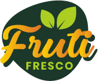
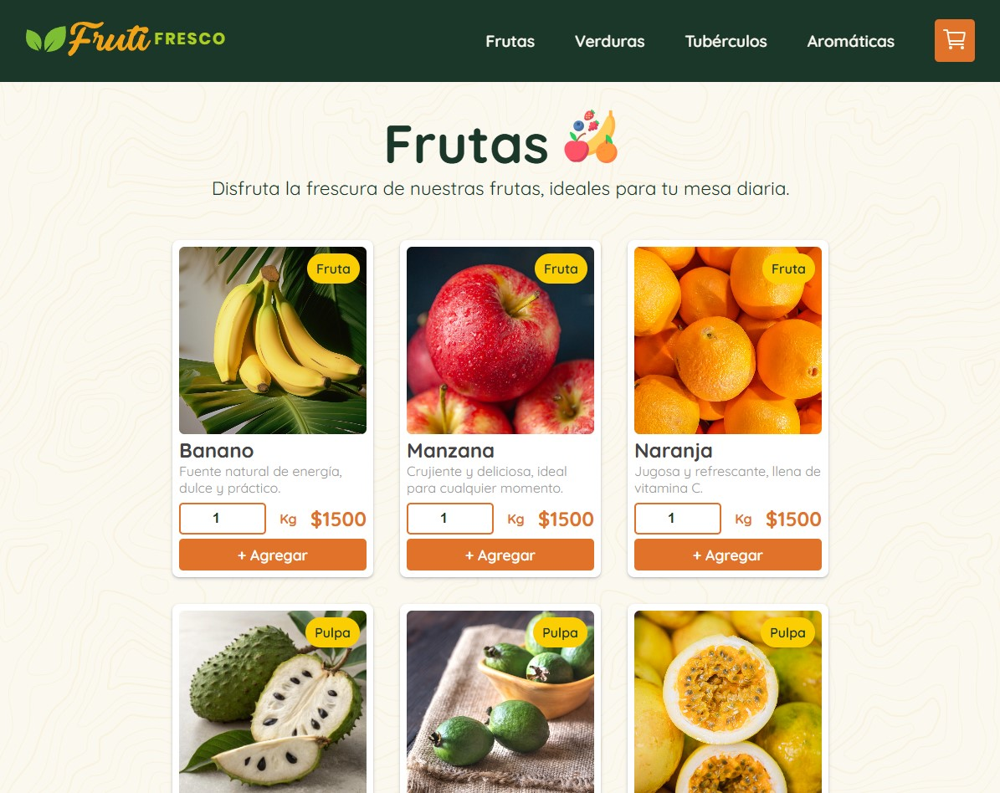
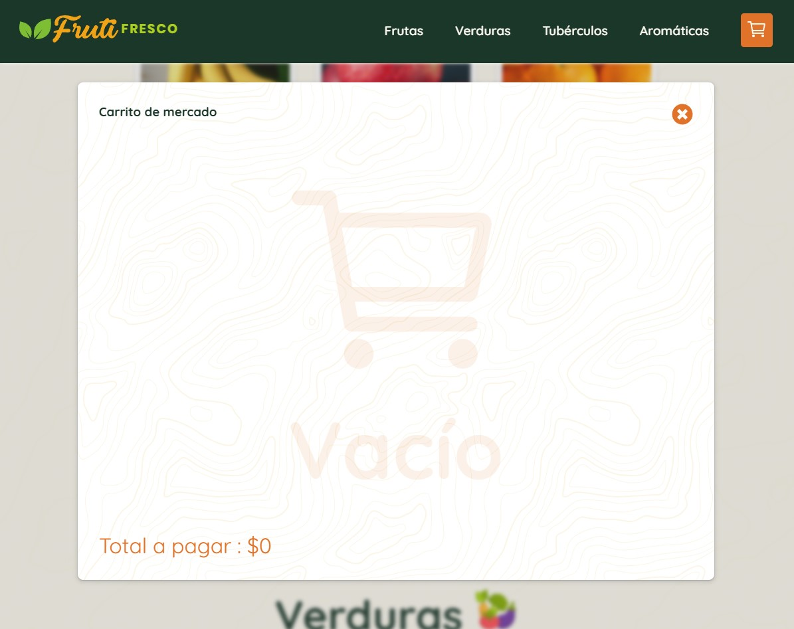
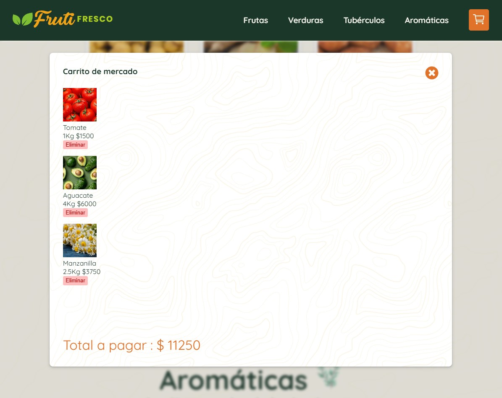

# 🚀  Fruti Fresco
## *Tienda virtual de frutas y verduras*

## 📌 Descripción

Este proyecto corresponde a un ejercicio académico. Aplicación de tienda online para la venta de productos de frutas y verduras, desarrollada en HTML, CSS y JavaScript. Cuenta con un carrito de compras en modal, agregar, eliminar y sumar precio de productos del carrito, de acuerdo a su peso, almacenándolas en el navegador con LocalStorage.

---

## 📝 Requerimientos del cliente

• Debe tener mínimo 4 secciones principales y cada una debe tener mínimo dos subsecciones. 
• Cada subsección debe tener mínimo 3 productos reales.
• Cada producto debe tener mínimo una fotografía o imagen descriptiva.
• Cada producto debe tener información descriptiva en texto para comprender de qué se trata el producto. 

---

## 🛠️ Tecnologías utilizadas

- **HTML5**
- **CSS3 (Flexbox / Grid / Animaciones)**
- **JavaScript (ES6+)**

---

## 🎯 Características

- ✅ Dispone de menú principal con cuatro secciones, cada una con productos clasificados por subsecciones usando etiquetas o tags en su tarjeta.

- ✅ Cada producto incluye imagen descriptiva, nombre y breve reseña para reforzar la semántica y accesibilidad.

- ✅ Se desarrolla un carrito de compras en ventana modal, el cual se actualiza dinámicamente al agregar o eliminar productos.

- ✅ El carrito realiza el cálculo automático de la suma de precios, respondiendo a la lógica de una tienda en línea.

- ✅ Se utilizan HTML, CSS y JavaScript para la construcción, priorizando la semántica del marcado HTML.

- ✅ Se incorporan microinteracciones como estados hover y active con transiciones para mejorar la experiencia de usuario.

- ✅ El diseño es responsive, adaptándose a escritorio, tablet y celular.

---

## 📸 Capturas de pantalla

---

## 🚀 Demo en vivo

👉 [Ver proyecto en GitHub Pages](https://ivan-develops.github.io/Tienda-virtual-Fruti-Fresco/)

---